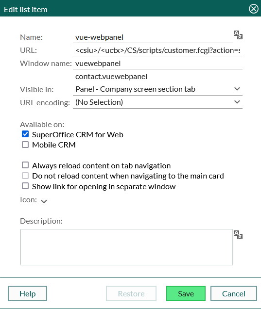

# superoffice-webpanel

This is a sample for a vueJs application that is hosted in an iframe(as a webpanel) inside of SuperOffice.
[App.vue](./src/App.vue) contains the code for fetching the `XSRF-TOKEN` from the current session/browser, and uses this to request company-information for the currently open contact_id. This is just a sample and should not be considered production-ready.

Please refer to the [documentation](https://vuejs.org/) if you are unfamiliar with this framework.

## Get started

1. Run `npm install`
2. Run `npm run build`. This will build and compile the assets to `./dist/assets`.
3. Upload the generated `index-xxxxx.js` and `index-xxxx.css` files from [./dist/assets](./dist/assets) as External documents in SuperOffice.
4. Create a new CRMScript in SuperOffice and add the content from [wepbalen.crmscript](./src/crmscript/webpanel.crmscript). Note that `jsDocumentId` and `cssDocumentId` needs to be adjusted to fit your environment, and should be fetched during upload (Step 3).
5. Create a new webpanel in SuperOffice, this example expects it to be visible in `Panel - Company screen section tab`.

URL: `<csiu>/<uctx>/CS/scripts/customer.fcgi?action=safeParse&includeId=<YourScriptIncludeId>&key=<YourScriptSecret>`



6. Open a Company in SuperOffice and open the webpanel
Note that `YourScriptIncludeId` and `YourScriptSecret` is set when creating the script, and needs to be adjusted in the URL above (replace these properties with what is in your environment).

--------------------------------------------------------

Note: Anything below this line comes from vueJs template and is kept as a reference for further development.

--------------------------------------------------------

This template should help get you started developing with Vue 3 in Vite.

## Recommended IDE Setup

[VSCode](https://code.visualstudio.com/) + [Volar](https://marketplace.visualstudio.com/items?itemName=Vue.volar) (and disable Vetur).

## Type Support for `.vue` Imports in TS

TypeScript cannot handle type information for `.vue` imports by default, so we replace the `tsc` CLI with `vue-tsc` for type checking. In editors, we need [Volar](https://marketplace.visualstudio.com/items?itemName=Vue.volar) to make the TypeScript language service aware of `.vue` types.

## Customize configuration

See [Vite Configuration Reference](https://vite.dev/config/).

## Project Setup

```sh
npm install
```

### Compile and Hot-Reload for Development

```sh
npm run dev
```

### Type-Check, Compile and Minify for Production

```sh
npm run build
```

### Run End-to-End Tests with [Playwright](https://playwright.dev)

```sh
# Install browsers for the first run
npx playwright install

# When testing on CI, must build the project first
npm run build

# Runs the end-to-end tests
npm run test:e2e
# Runs the tests only on Chromium
npm run test:e2e -- --project=chromium
# Runs the tests of a specific file
npm run test:e2e -- tests/example.spec.ts
# Runs the tests in debug mode
npm run test:e2e -- --debug
```

### Lint with [ESLint](https://eslint.org/)

```sh
npm run lint
```
